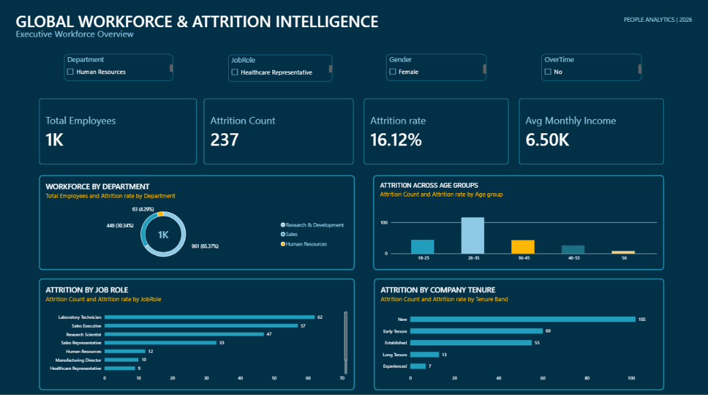
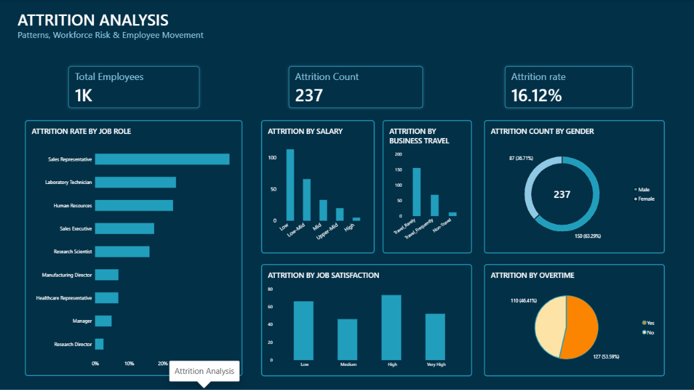
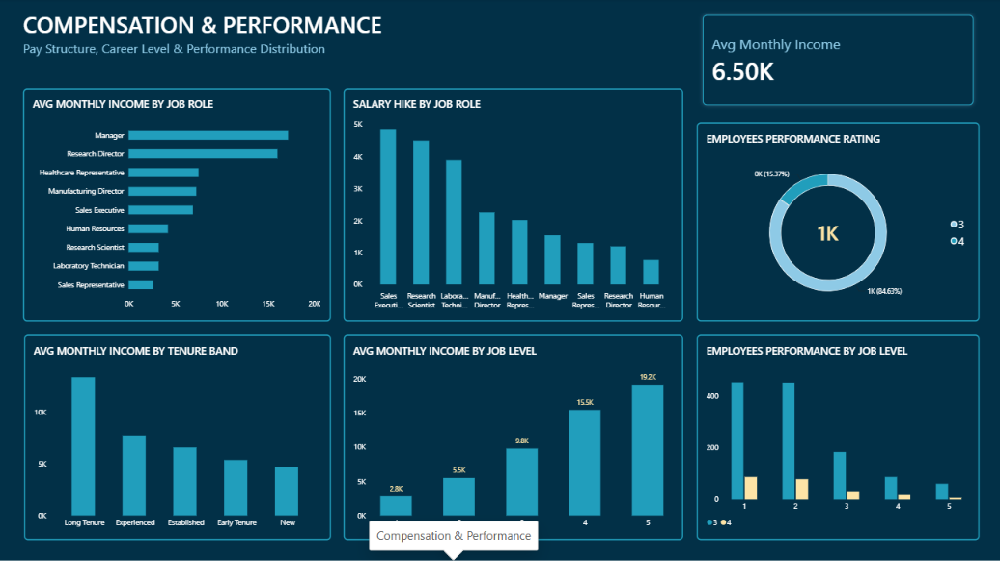
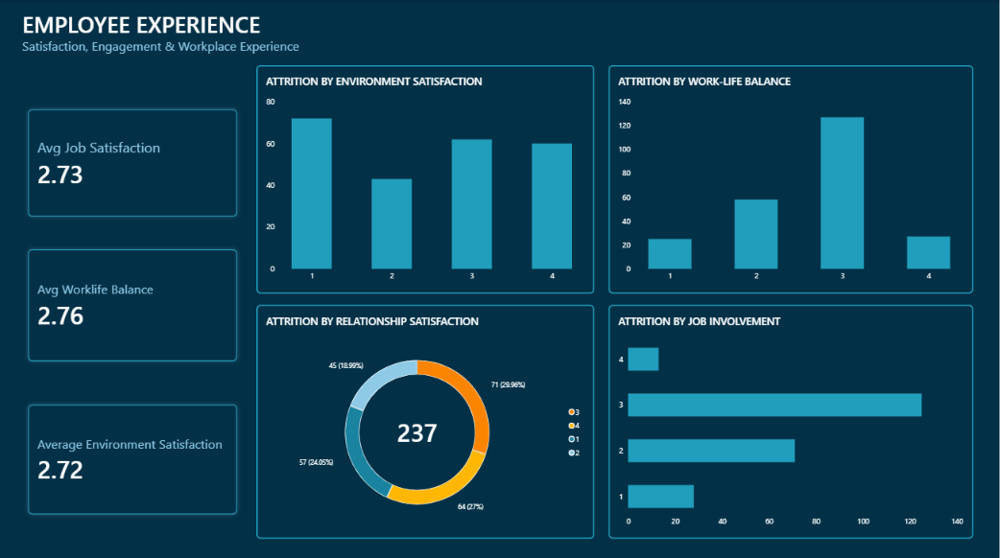

# Global Workforce & Attrition Intelligence

An interactive Power BI dashboard for analyzing workforce composition,
employee attrition, compensation, performance, and employee experience.

---

## 📊 Dashboard Preview

### Executive Overview

### Attrition Analysis

### Compensation & Performance

### Employee Experience

---

## 🎯 Project Overview

This project demonstrates how Power BI, Power Query, and DAX can be used
to transform employee data into an interactive workforce analytics solution.

The dashboard is presented through a fictional MNC workforce analytics
scenario and is designed to help analyze workforce patterns, attrition,
compensation, performance, and employee experience.

The underlying dataset is a publicly available HR analytics dataset and
does not represent proprietary data from a real company.

---

## 💼 Business Objectives

The dashboard focuses on:

- Understanding workforce composition
- Monitoring employee attrition
- Identifying differences in observed attrition across workforce segments
- Analyzing compensation across job roles and job levels
- Examining employee performance
- Exploring employee satisfaction and workplace experience
- Supporting data-driven HR analysis

---

## 📈 Dashboard Pages

### 1. Executive Overview

Provides a high-level workforce summary including:

- Total Employees
- Attrition Count
- Attrition Rate
- Average Monthly Income
- Workforce by Department
- Attrition by Job Role
- Attrition across Age Groups
- Attrition by Company Tenure

### 2. Attrition Analysis

Explores observed attrition patterns across:

- Overtime
- Business Travel
- Salary Bands
- Job Roles
- Gender
- Job Satisfaction

### 3. Compensation & Performance

Analyzes:

- Average Monthly Income by Job Role
- Average Monthly Income by Job Level
- Average Monthly Income by Tenure
- Performance Rating Distribution
- Performance by Job Level
- Average Salary Hike by Job Level

### 4. Employee Experience

Examines:

- Work-Life Balance
- Environment Satisfaction
- Job Involvement
- Relationship Satisfaction

---

## 🛠️ Tools & Technologies

- **Power BI Desktop**
- **Power Query**
- **DAX**
- **CSV**
- **GitHub**

---

## 🧹 Data Preparation

The dataset was prepared using Power Query.

Key transformation steps included:

- Data quality validation
- Duplicate validation
- Data type validation
- Removal of redundant fields
- Creation of Age Groups
- Creation of Salary Bands
- Creation of Company Tenure Bands
- Validation of categorical fields

Redundant fields removed:

- EmployeeCount
- EmployeeNumber
- Over18
- StandardHours

---

## 🧮 DAX

Key measures developed for the dashboard include:

- Total Employees
- Attrition Count
- Attrition Rate
- Average Monthly Income
- Average Job Satisfaction
- Average Work-Life Balance
- Average Environment Satisfaction

The dashboard also uses calculated fields for analytical grouping and
sorting of workforce segments.

Detailed formulas are available in:

`documentation/dax-measures.md`

---

## 🔎 Key Dataset Insights

The dataset contains:

- **1,470 employees**
- **237 employees with recorded attrition**
- **16.1% overall observed attrition rate**

Some notable observed patterns include:

- Employees with overtime had a higher observed attrition rate than
  employees without overtime.
- Attrition rates varied considerably across job roles.
- Employees in the shortest company-tenure segment showed higher observed
  attrition than several longer-tenure groups.
- Attrition varied across salary bands and business-travel categories.
- Job and environment satisfaction levels showed differences in observed
  attrition rates.

Detailed analysis is available in:

`documentation/business-insights.md`
